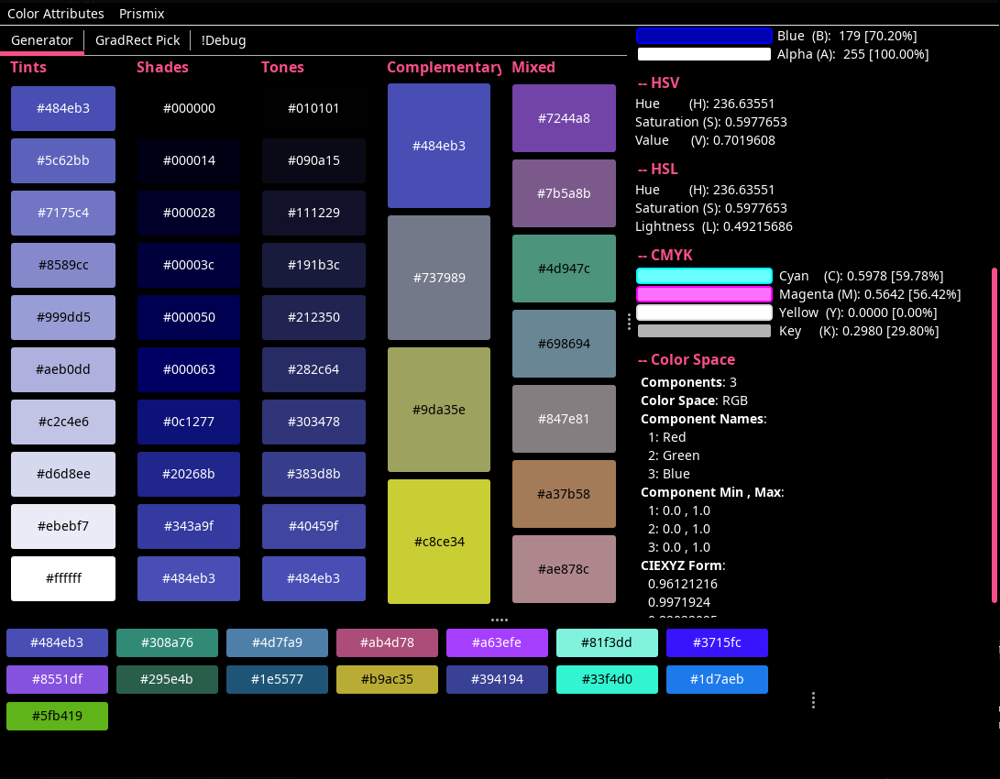

<h1 align="center">Prismix</h1>

> **Version** Preview Beta *July 01 2023*

 

 

Color palette generator and color picker for helping you with picking colors (I guess).

## First time

### Other users (OSX, Windows)

**Running from Source**

First read the specifications for environment requirements.

Specifications:
* Main Class: `pkg/src/com.jackmeng.prismix.jm_Prismix`
* Provided META-INF: `pkg/src/META-INF/MANIFEST.MF`
* Class Path: `com.jackmeng.prismix`
* Required libs: `pkg/lib/*.jar`

**Using the prebuilt JAR**

The JAR can be downloaded from the desired released from the [`Releases Tab`](https://github.com/exoad/Prismix.java/releases). It is recommended that you download a *release* and not *preview*, *nightly*, *test* tagged releases.

To run this JAR, make sure you have the following environment requirements:
1. Java `17 or up` | [Adoptium Temurin](https://adoptium.net/temurin/releases/) | [OpenJDK SE17](https://jdk.java.net/java-se-ri/17) | [Azul Zulu](https://www.azul.com/downloads/#downloads-table-zulu) | [Amazon Corretto](https://docs.aws.amazon.com/corretto/latest/corretto-17-ug/downloads-list.html) | [GraalVM](https://www.graalvm.org/downloads/#) | [OracleJDK](https://www.google.com/url?sa=t&rct=j&q=&esrc=s&source=web&cd=&cad=rja&uact=8&ved=2ahUKEwifsb_jwYmAAxWjFlkFHQHMDPUQjBB6BAgVEAE&url=https%3A%2F%2Fwww.oracle.com%2Fjava%2Ftechnologies%2Fdownloads%2F&usg=AOvVaw0DKQD-JnLlas21toABBqtk&opi=89978449) | [JetBrains](https://github.com/JetBrains/JetBrainsRuntime/tree/jbr17)
2. A display (like a working monitor, something that can show pixels)
3. **Optional** but preferred: X (not Wayland)

### Linux users

**Using the prebuilt bundle**

> Note: X86-64 only!

This provides you with the necessary tools to run the program without worrying about setting up Java on your end. Just download, extract, and run `Prismix`.

## Usage

The program uses a YAML configuration which you can find after your first `run and exit` sequence under `./exoad/com_jackmeng_prismix_CONFIG.yml`. Here you will find the raw configuration.

**Encountered a bug or want a feature?**
Report it here: https://github.com/exoad/Prismix.java/issues

<code>
Copyright (C) Jack Meng (AKA exoad) 2023. All rights reserved.
</code>

<pre>

Redistribution and use in source and binary forms, with or without
modification, are permitted provided that the following conditions are met:
   1. Redistributions of source code must retain the above copyright notice,
      this list of conditions and the following disclaimer.
   2. Redistributions in binary form must reproduce the above copyright
      notice, this list of conditions and the following disclaimer in
      the documentation and/or other materials provided with the
      distribution.
   3. All advertising materials mentioning features or use of this software
      must display the following acknowledgment: This product includes
      software developed by Jack Meng (exoad).
   4. Neither the name of Jack Meng (exoad) nor the names of its
      contributors may be used to endorse or promote products derived
      from this software without specific prior written permission.

THIS SOFTWARE IS PROVIDED BY JACK MENG (EXOAD) AS IS AND ANY EXPRESS OR IMPLIED
WARRANTIES, INCLUDING, BUT NOT LIMITED TO, THE IMPLIED WARRANTIES OF MERCHANTABILITY
AND FITNESS FOR A PARTICULAR PURPOSE IS DISCLAIMED. IN NO EVENT SHALL
JACK MENG (EXOAD) BE LIABLE FOR ANY DIRECT, INDIRECT, INCIDENTAL, SPECIAL, EXEMPLARY,
OR CONSEQUENTIAL DAMAGES (INCLUDING, BUT NOT LIMITED TO, PROCUREMENT OF SUBSTITUTE
GOODS OR SERVICES; LOSS OF USE, DATA, OR PROFITS; OR BUSINESS INTERRUPTION) HOWEVER
CAUSED AND ON ANY THEORY OF LIABILITY, WHETHER IN CONTRACT, STRICT LIABILITY, OR TORT
(INCLUDING NEGLIGENCE OR OTHERWISE) ARISING IN ANY WAY OUT OF THE USE OF THIS SOFTWARE,
EVEN IF ADVISED OF THE POSSIBILITY OF SUCH DAMAGE.

</pre>

